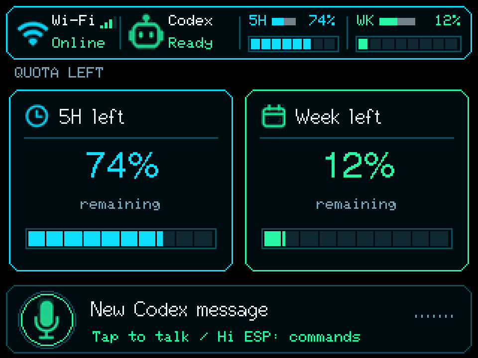
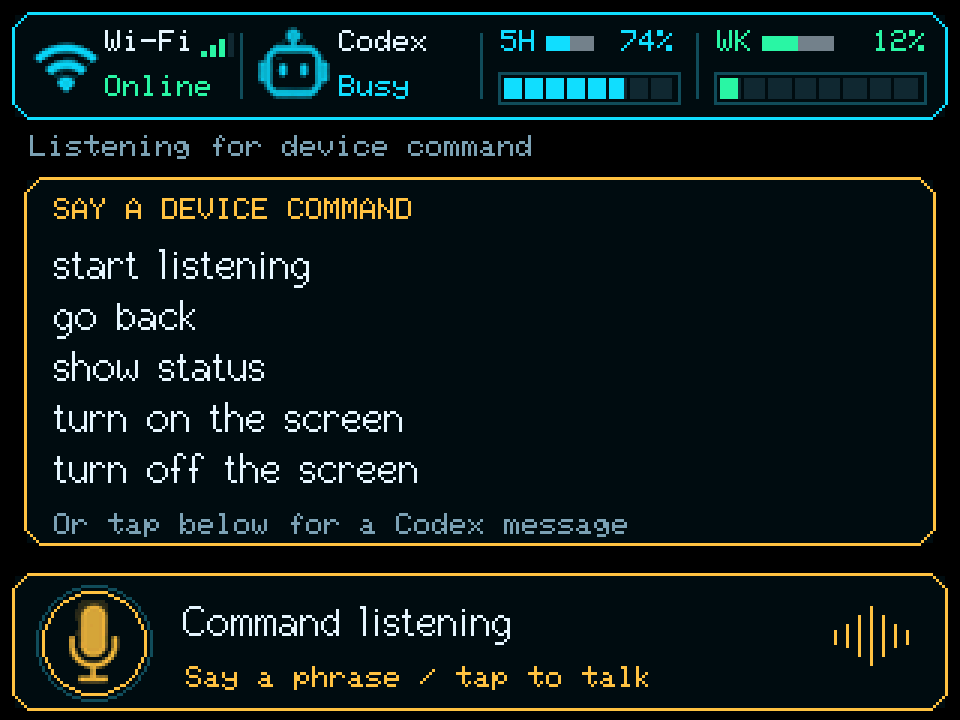
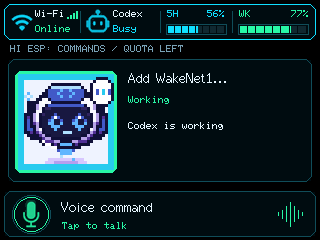

# Codex monitor firmware

The FNK0104B shows Codex five-hour and weekly remaining quota on an idle landscape page. The angular cyan status strip shows Wi-Fi signal strength, Codex state, and segmented remaining-quota bars (`5H` and `WK`). A tiny bar between each label and percentage counts down to its reset: full width is five hours for `5H` or seven days for `WK`; half width is 2.5 hours or 3.5 days. Gray shows elapsed time; cyan/mint shows time still remaining. Both bars use the same high-contrast gray track. Missing reset/time data shows a muted dash. The countdown uses the bridge timestamp plus cache age and elapsed device time, and refreshes only the header when its fill changes. When an agent runs, the two quota cards give way to a larger avatar view; remaining percentages stay visible in the header, and up to four agents appear at once. Tap any visible agent to read its short detail and explicitly target the next voice message to that thread, including an agent that is still running. The bridge adds messages to a running turn through its existing steering path. A voice message without a selected agent starts a new Codex thread through the local bridge. Completed agents disappear on the next successful status poll. HTTP polling runs separately from touch and drawing so a bridge request does not pause the voice button. The screen redraws only when visible state changes.



This preview uses sample values. The cyan/mint icons are tintable masks derived
from the owner's UI references; the firmware renders them in RGB565 at 320×240.

Tap **New Codex message** (or **Message to agent** after selecting an avatar)
and wait for **Recording message** before speaking. This tap-to-talk flow sends
free-form speech to Codex; the wake-word flow listens for local device commands. The button shows **Preparing mic** during capture
preparation and **Sending voice** while transcription runs. Successful submission briefly
shows `Sent:` followed by the recognized text. Serial diagnostics report voice
stages, recording duration, and HTTP result without printing the transcript.
Status requests allow up to 15 seconds for the bridge's Codex queries; this
wait occurs on the status task and does not pause touch handling. Stream failures report a serial diagnostic and clear stale usage.

The board uses saved Wi-Fi credentials and streams status from `monitor-server` on the local network. It never connects directly to a Codex account or stores account credentials. The bridge attaches to the local Codex app-server and sends audio to a host transcription service. See [the contract](../../docs/monitor-contract.md) and [bridge setup](../../monitor-server/README.md).
The separate [mock server](../../monitor-server/MOCK.md) provides controllable states for a board test without Codex.

## Configure and build

Follow [the full server-to-board setup guide](../../docs/monitor-setup.md) for
server launch commands, WSL networking and connection checks. The public Pages
firmware has no private bridge host/key; use the configured local build below.

1. Copy `include/monitor_secrets.example.h` to `include/monitor_secrets.h` and set `MONITOR_SERVER_HOST` to the LAN address of the machine running the bridge. Set `MONITOR_SERVER_TOKEN` to the same value as the bridge's `MONITOR_TOKEN`; the copied file is Git-ignored. The board must already have Wi-Fi credentials saved, for example by the `wifi-ble` firmware.
2. Start the bridge with a LAN bind and configure a trusted `TRANSCRIBE_URL` for speech. Without transcription, status still works and the voice request returns a clear error.
3. Run `pio run -e codex-monitor`. Build before upload; then use `pio run -e codex-monitor -t upload` and inspect `pio device monitor -b 115200`.

The platform remains pinned at `platformio/espressif32@7.0.1`. This app uses
Arduino-ESP32 3.3.12 as an ESP-IDF 5.5.5 component, with GCC 14.2.0
(20260121) and ESP-SR 2.5.5;
other Arduino apps retain their existing runtime. The separate
`dependencies.monitor.lock` pins the monitor's component graph. A local
`scripts/monitor_idf_compat.py` supplies PlatformIO 7.0.1's linker-preprocessor
interface and IDF text-asset generators without changing installed packages.
The SDK's optional Arduino cloud libraries are disabled and never initialized.
Arduino component integration follows [Espressif's supported IDF 5.5 path](https://docs.espressif.com/projects/arduino-esp32/en/latest/esp-idf_component.html).

**Flash layout changes:** this firmware preserves the Arduino NVS boundary:
20 KiB NVS at `0x9000`, PHY at `0xf000`, a 6 MiB factory app at `0x10000`,
and models at `0x610000` (0x9f0000 bytes). Uploading from the previous Arduino
monitor replaces its OTA/FATFS layout and overwrites old FATFS files;
back up required flash data first. There are no OTA slots. The speech
diagnostic/recorder have a different NVS size; preservation from those layouts
is not guaranteed. PlatformIO uploads the
WakeNet10, VADNet and MultiNet model image automatically. The browser package
also includes that image and omits the Arduino `boot_app0` image. No account secret or Wi-Fi password belongs in this firmware's source code.

## Settings and audio

The monitor advertises `FNK0104B-MONITOR` over BLE automatically at boot; no pairing button or Windows Settings pairing is required. Use the web page's **Connect to monitor** picker. The full name is in the primary advertisement and the settings service UUID is in the scan response, keeping each packet within the legacy BLE size limit. Serial `monitor_ble` messages report packet configuration, advertising start, connection and disconnection. The repository web flasher's **Monitor settings** section reads and saves alert volume and screen timeout. Defaults are 50% and 30 minutes. The Web BLE **Idle screen timeout** setting accepts 1–120 minutes and persists across reboots. Active agents (including agents waiting for input or reporting an error) and voice work keep the screen on. The countdown starts after work finishes and resets on touch. Touch or new agent activity wakes the screen automatically. An audible attention alert requires a speaker on the board's PH1.25 connector. The onboard microphone continuously feeds the shared AFE, while the voice worker
copies processed audio for submission. Attention tones pause microphone reads
under the audio mutex, then capture resumes. The I²C mutex only covers codec
setup and speaker use, so continuous microphone reads do not block touch.

App-server approval requests are indicated for review in the Codex app. The monitor does not grant permissions or approvals by voice. Simple agent questions can be answered by a targeted voice command when the bridge has received the pending question.

The integrated firmware was uploaded to a physical board and polled the mock over Wi-Fi on 2026-09-29. The owner confirmed that the landscape avatar screen looked stable and readable. Live Codex thread visibility, on-board voice upload, BLE settings, and audible speaker output remain to be checked; see [readiness](../../docs/monitor-readiness.md).

Quota cards and bars show what remains: `100 - used_percent`. Unknown values stay `--%`; the bridge contract and serial diagnostics continue to report used percentages.

## Local wake and commands (0.5.0)

Say **Hi ESP** to open the on-screen phrase guide and amber **Command listening**
control, then one of these English phrases within twelve seconds:



| Phrase | Action |
|---|---|
| start listening | Record a voice message to the bridge, targeting the selected agent if present |
| go back | Return from agent detail or quota status to the agent overview |
| show status | Show quota cards even while agents run, and request a fresh bridge status |
| turn on the screen | Enable the backlight and resume the status stream |
| turn off the screen | Disable the backlight and pause the stream |

Local commands work without a bridge connection; voice submission still needs
Wi-Fi and the configured bridge/transcription service. A wake re-enables a dark
screen. Explicit screen-off stays off until touch or wake; idle sleep retains
its existing automatic wake policy. Voice work prevents explicit screen-off.
WakeNet/MultiNet recognition is suspended during voice capture/submission;
tap the record button to stop early. Tapping to talk while the command guide is
open takes priority and starts a Codex message. Audio meters in both listening
modes respond to microphone volume rather than a decorative animation. Agent
avatars do not draw over the guide or recording panel. Tap quota cards or say
**go back** to leave the status view; fresh agent updates keep that view open.

The device-tested speech PoC supplies `wn10_hiesp`, English MultiNet7 and
`vadnet1_medium`, with its ESP-DL convolution kernel selection. VAD receives
16 kHz mono audio with 128 ms minimum speech, 1000 ms minimum silence and
128 ms delay. All continuous AFE frames reach recognition; VAD does not gate
or clip prefixes. AEC, NS and AGC remain disabled. Recording ends after the
VAD silence debounce plus four more seconds (approximately five seconds of
silence), or at thirty seconds; a recording with no detected speech is discarded
after ten seconds. Speaking again during the silence grace period resets it. Audio only goes to
the bridge after a tap or recognized start-listening command.

Build/host-test evidence and combined hardware checks are tracked in
[monitor readiness](../../docs/monitor-readiness.md). Recognition accuracy,
Wi-Fi/BLE coexistence, attention-tone recovery and long-run timing for this
new combined firmware remain UNKNOWN until tested on the board.

### Wi-Fi setup and browser updates

The monitor opens secure BLE setup on first boot without saved Wi-Fi. Hold the
Wi-Fi indicator at the top left for three seconds to change networks. Enter the
fresh 12-character code displayed on the board in the Web BLE page, connect, and
wait for “Connected securely” before entering the 2.4 GHz network credentials.
Setup uses the diagnostic's Security 1 (X25519 / AES-CTR with proof of possession)
protocol and FNK0104B-SETUP service. Normal settings BLE and speech processing do
not run during setup; successful provisioning returns to the monitor after the
provisioning manager's browser-query grace period. Cancel or a five-minute idle
timeout restores the credentials present at entry and restarts. After a rejected
password, cancel and re-enter setup to retry. Power loss after submitting new
credentials can leave those new credentials saved even if connection failed.

Browser manifests now ask whether to erase the device, with erasing unchecked.
Leave it unchecked to preserve Wi-Fi and monitor preferences across compatible
updates. The monitor keeps the Arduino NVS offset 0x9000 and size 0x5000; it still
replaces OTA/FATFS with a 6 MiB app and speech models. Switching from diagnostic
firmware with a different NVS size is not a guaranteed preservation path. Already
erased settings cannot be recovered: enter Wi-Fi once through setup.

Use a trusted HTTPS page and the code from your physical board. Browser permission
and the advertised name alone do not authenticate a board. The separate monitor
volume/timeout BLE service is unauthenticated and must not carry secrets. Wi-Fi
setup encrypts credentials in transit; it does not enable encrypted flash storage.
Physical setup, incorrect-code rejection, cancellation, successful return, and
credential preservation across browser updates still require on-board checks.

The combined hardware startup was verified on 2026-10-03: continuous AFE audio,
saved Wi-Fi reconnection and the live SSE stream ran together. The monitor
reserves its internal feed stack and initializes microphone DMA before models
to avoid startup heap fragmentation. See the hardware record for evidence and
remaining command/recording/speaker checks.

### Actual display screenshot



This 320 × 240 image was refreshed on 2026-10-04 from the flashed board's LCD
memory, with live status at capture time. The [device record](../../test/hardware/codex-monitor-voice-ui-2026-10-04.md)
includes upload verification, serial evidence and the remaining interaction checks. It is also shown on the GitHub Pages flasher. To capture another
image after flashing this monitor build, close other serial terminals and run:

```sh
python3 scripts/capture_monitor_screen.py docs/images/codex-monitor-screen.png --port /dev/ttyACM0
```

The script uses PlatformIO Core's 115200-baud interactive monitor, sends the
`screenshot` command, validates all 240 RGB rows, and saves a PNG. Normal speech
and status processing continue while display updates pause for the capture.
Screenshot capture is unavailable during Wi-Fi setup or voice submission.

## Concurrent Codex vendor HID

The monitor now includes an independent USB vendor HID backend alongside its
existing Wi-Fi/SSE integration. Native USB changes to `303a:8360` and retains
CDC serial; USB Serial/JTAG is unavailable while USB-OTG owns the internal PHY.
`hid-agent0` followed by Enter over serial queues a diagnostic AG00 tap. Input
is never emitted automatically, and Desktop slot status does not replace Wi-Fi
agents. See [protocol evidence, testing and limitations](../../docs/codex-hid.md).

Without Desktop discovery (USB absent or USB mounted without a recognized host
call), the header says **Codex** with bridge status: **Online**, **Busy**,
**Input**, **Error**, **Check** or **Offline**. The bottom panel is one full-width
**Wi-Fi voice** control; every tap in that panel uses the existing
recording/dispatch path, including taps on its left side.

After Desktop discovery, **Micro Linked** or **Micro Idle** replaces that status
cell and separate **Micro voice** and **Send** controls appear. USB Micro pauses
local recognition and bridge recording while the host owns raw USB microphone audio. Idle
retains the Micro controls for a quiet host; it is not proof of an app
disconnect. USB disconnect restores the Wi-Fi layout and clears held Micro
touch state. The 2026-10-07 build was flashed and LCD readback verified the
Wi-Fi-only layout. Live Windows discovery/status calls received completed HID
replies. Micro appearance, physical touch and reconnect checks remain open;
see the [device record](../../test/hardware/monitor-adaptive-ui-2026-10-07.md).

The firmware includes a mono PCM16/16 kHz USB microphone. Micro voice
sends the ACT10 key; select the board as the host input and choose Voice Chat
in Desktop Micro settings for tap-to-start behavior. The waveform shows local
mic input while USB capture is active. See [audio setup and verification](../../docs/codex-audio.md).

## October 8 configuration and USB controls

Monitor 0.6.1 disables integrated BLE HID so browser settings have their own BLE
service. USB Micro defaults to three stable agent slots plus four joystick direction
buttons; choose six slots on the setup page. Repeated Desktop lighting packets no
longer clear the whole screen. See [the decision, setup steps and open checks](../../docs/usb-micro-controls.md).
