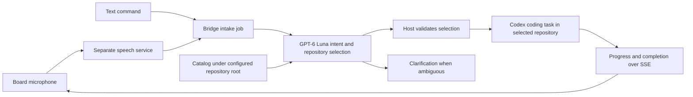

# Local Codex orchestrator feasibility

Follow-up: the dispatcher was subsequently implemented and enabled. See the
[implementation and device record](../test/hardware/codex-monitor-dispatcher-2026-10-04.md)
and [configuration guide](../monitor-server/README.md#luna-repository-dispatcher).
The research-stage gaps below describe the baseline before that implementation.

Researched and probed on 2026-10-04. This is a research and validation record;
the production bridge has not yet been changed to implement repository routing.

## Decision

The proposed workflow is feasible using the existing Python bridge and local
Codex app-server connection:



The orchestrator process, repository discovery and coding tools run on the host.
Codex model inference still uses the signed-in provider; a locally running bridge
does not make GPT-6 Luna an offline model. Speech remains a separate service;
the current configured endpoint is a local speech facade rather than a required
OpenAI audio endpoint. Text-to-speech is optional and is not implemented in the
monitor command path.

Prefer app-server for this implementation. Official documentation provides
`model/list`, `thread/start` with `model` and `cwd`, structured turn output via
`outputSchema`, and turn events. The Codex SDK is another supported integration,
but replacing the existing transport is not needed to establish feasibility.
See [app-server](https://learn.chatgpt.com/docs/app-server) and
[Codex SDK](https://learn.chatgpt.com/docs/codex-sdk).

[GPT-6 Luna](https://developers.openai.com/api/docs/models/gpt-6-luna) supports
structured text output and does not accept audio. The transcript belongs before
the router. Verify actual model access with an inference request, not only a
catalog entry.

## Evidence from this session

| Check | Result | Boundary |
|---|---|---|
| Installed CLI | `codex-cli 0.160.0` | Host observation |
| Existing daemon connection | Bridge client connected through its configured Unix WebSocket endpoint | No second isolated app-server was started |
| Model catalog | Included `gpt-6-luna` and `gpt-6.1-sol`; Luna supports `low` effort | Catalog alone would not prove inference access |
| Real Luna routing | Selected `FNK0104B` for a supplied board-firmware request; valid schema output; completed in 4.12 seconds | One explicit repository example, not a routing accuracy benchmark |
| Real coding handoff | Separate `gpt-6.1-sol` task used `/home/cmwen/dev/FNK0104B`, read the firmware source, reported `0.5.0`; completed in 9.74 seconds | Temporary probe chose the validated path; production routing remains absent |
| Ambiguous request | Luna returned `clarify`, repository `UNKNOWN`, and a question for “Fix the bug”; completed in 5.31 seconds | One ambiguity example |
| Running HTTP bridge | Authenticated `/v1/commands/text` returned HTTP 200; created task completed and reported firmware `0.5.0` in the configured repository | Host-originated text request, not a voice upload |
| Bridge regression suite | All 48 tests passed | Host tests use controlled transports |
| Board discovery | PlatformIO Core found Espressif `303a:1001` at `/dev/ttyACM0` | No firmware build or upload was performed in this session |
| Board status path | PlatformIO serial at 115200 showed `integration=connected`, changing active-agent counts and real quota values during the task check | Confirms live bridge-to-board status delivery |
| Speech runtime | Serial repeatedly showed WakeNet processing and roughly 7 KiB free internal heap, without an observed panic | Short observation; no capture/upload was observed |
| Speech facade | `/health` responded HTTP 200 but reported `ok:false`, missing Chinese STT and TTS models | Does not independently establish English transcription success or failure |

The model probes used read-only, ephemeral threads. The HTTP bridge smoke test
created a normal task, ID `01a10442-112b-73c3-9c41-b12ae529aa5d`. Its completion
was checked through `thread/read`. An immediate read initially encountered an
empty rollout metadata error; a later read succeeded. A job observer must allow
for that startup race. No source edits were requested from these test tasks.

Prior [2026-10-02 evidence](../test/hardware/codex-monitor-live-2026-10-02.md)
records a real board voice upload creating and completing a Codex task, with an
incomplete transcript. The firmware voice path has since changed. That older
test does not establish current wake/VAD capture accuracy or repository routing.

## Current code and gaps

| Area | Existing behavior | Required work |
|---|---|---|
| Shared intake | Text and transcribed voice converge on `Bridge.command()` | Insert new-task routing here; preserve explicit thread targeting |
| Repository choice | Every new task uses `MONITOR_AGENT_CWD`; `run.py` defaults it to this checkout | Add repository-root configuration and a bounded Git repository catalog |
| Model choice | Production `thread/start` sends only `cwd` and inherits its model | Set separate configurable router and worker models, validate availability |
| Classification | No classifier or structured routing result | Collect full router output, validate schema and catalog ID; handle ambiguity |
| Router output | `AppServer.latest_messages` retains only the last 120 characters for display | Add a dedicated full-result collector; never parse routing JSON from display snippets |
| Voice latency | Firmware waits 30 seconds; transcription can itself take 30 seconds; app-server requests have additional waits | Acknowledge a job quickly and perform transcription/routing asynchronously |
| Progress | SSE carries agents and quotas; initial response means task started | Add explicit intake-job stages, selected repository, worker ID and terminal outcome |
| Completion | Idle/completed threads disappear from active avatars | Retain a brief completion/error result for the originating board job |
| Retries | No intake idempotency key | Use a board-generated request ID; avoid duplicate work after timeouts/reconnects |
| Clarification | Existing targeted commands can answer a single pending agent question | Add router-level clarification state and show its question; do not start a worker on ambiguity |
| Approvals | Bridge refuses voice/text approval requests | Preserve this behavior and surface where a real request can be reviewed; verify desktop handling for bridge-created tasks |
| Speech reliability | Endpoint configured; current physical speech test absent | Measure transcript accuracy, silence/pauses and recovery on current firmware |
| Response size | Firmware accepts at most 1024 response bytes and briefly shows 40 transcript characters | Keep acknowledgements compact; transmit richer job state in bounded SSE payloads |

Production changes should not hold the status-cache lock while waiting for a
router model: `Bridge.command()` currently holds it around command handling.
Otherwise a slow classifier can stall status requests. Use per-job synchronization
and brief shared-state updates instead.

## Proposed environment contract

These new names are a proposal, not currently implemented settings:

```dotenv
MONITOR_REPOSITORY_ROOT=/home/cmwen/dev
MONITOR_ROUTER_MODEL=gpt-6-luna
MONITOR_ROUTER_EFFORT=low
MONITOR_WORKER_MODEL=gpt-6.1-sol
MONITOR_REPOSITORY_SCAN_DEPTH=3
```

`MONITOR_AGENT_CWD` already works for a single fixed repository. Retain that
mode when repository-root routing is disabled. If root routing is enabled,
require a valid catalog selection or clarification rather than silently falling
back to the board checkout.

The current development root contains nested repositories, including workspaces
and grouped app directories. A one-level directory listing will miss targets.
Discovery should be bounded by depth/count, skip dependency/build directories,
recognize both `.git` directories and worktree `.git` files, and cache results.
Use canonical paths contained within the configured root. Never accept a model-
generated filesystem path as the worker's workspace.

Give Luna a catalog of stable IDs, names, relative paths and short bounded
descriptions. Have it return a schema such as:

```json
{
  "intent": "task",
  "repository_id": "FNK0104B",
  "task": "Report the firmware version without changing files.",
  "clarification": ""
}
```

An ambiguous request returns `intent: clarify` and an explicit question. The
host checks the repository ID against its catalog and resolves the path itself.
Preserve the original transcript alongside the interpreted task. Evaluate
misheard repository names and requests that mention several repositories before
enabling automatic dispatch. User-provided confidence scores are not sufficient
evidence of routing correctness.

The classifier needs no repository shell execution. Supply catalog data from
the host and disable unnecessary tools/configured integrations where supported;
a read-only sandbox alone does not disable tools or prevent file reads. Keep the
worker in the selected repository so its project instructions apply. An explicit
`agent_id` should continue addressing that thread without reclassifying its
repository. Add thread ownership/authorization policy if this becomes a shared
multi-user bridge.

## Acceptance checks before declaring the board end to end ready

1. On the current firmware, say “Hi ESP,” then “start listening,” then dictate a
   harmless task identifying FNK0104B. Confirm serial capture duration and upload,
   exact recognized transcript, selected repository, worker task and completion.
2. Repeat with another configured repository. Confirm the worker's actual `cwd`
   and a small agreed reversible file change, with an inspectable diff. The probes
   here only establish read-only task execution.
3. Give an ambiguous command. Confirm a question appears and no coding task
   starts until the answer identifies the repository.
4. Send a voice answer to a selected running/attention task and confirm it reaches
   the correct existing thread. A spoken approval must remain blocked.
5. Delay or disconnect transcription, routing and worker services. Confirm the
   board reports failure/progress, retry does not duplicate tasks, and reconnect
   recovers the same job.
6. Exercise long recordings, thinking pauses and simultaneous SSE activity;
   monitor internal-heap pressure and device resets. Validate supported languages
   against the installed speech models.

Current verdict: real local model routing and repository-specific coding
execution are proven by probes; the production router is absent; the current
physical voice-to-routed-task acceptance check remains **UNKNOWN**.
