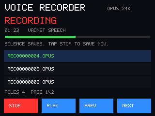

# Voice recorder screen

This is a 320×240 host-rendered preview with sample recording names, duration
and microphone activity. It runs the firmware's actual drawing routine and
shared bitmap font against a host framebuffer. It is not a photograph or a
live capture of the attached board.

See the [recorder guide](../apps/20-recorder/README.md) for controls and the
[scripts guide](../scripts/README.md#recorder-ui-preview) to regenerate it.
The GitHub Pages app displays the same image; its packager copies the canonical
`docs/images/recorder-ui.png` asset into the published site.
