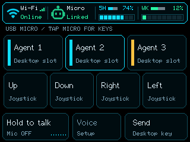

# USB Micro controls and wireless configuration — 2026-10-08

## Decision

The owner prioritizes Wi-Fi bridge operation and USB Micro when connected to a
computer. BLE HID is optional and must not interfere with browser configuration.
Monitor 0.6.1 therefore reserves BLE for settings and protected Wi-Fi provisioning.
The isolated `codex-ble-diag` remains available for future investigation; the
monitor no longer starts the BLE HID service, bonding callbacks or pairing gesture.
This supersedes the integrated BLE Micro and six-slot default in the October 7 plan.

## Investigation

The monitor had started HID and settings on one BLE server. HID installed global
bonding/security callbacks and allowed one peer, so a computer's HID connection
could deny a browser settings connection. This is a code-supported conflict,
not a reproduced physical root cause. The current browser already accepts both
`Codex Micro` and `FNK0104B-MONITOR`; the old name alone is not the cause.

Desktop `v.oai.thstatus` packets were also setting `uiDirty` unconditionally.
`drawScreen()` clears the complete LCD, even for repeated identical values.
Now packets retain protocol replies and status but redraw only changed agent
tiles; revision/effect/speed changes alone do not repaint static tiles. Visible
connection changes, touch, bridge updates and screen wake can still redraw the
screen. This fix does not claim all refreshes originated from HID.

## Wireless setup

Keep the board powered. On the setup page, use Chrome/Edge over HTTPS or localhost
and choose **FNK0104B-MONITOR** for normal settings. USB HID can stay connected;
the BLE settings service does not establish a Micro session. No OS pairing is
needed. Close another connected settings tab before reconnecting. A previously
paired Codex Micro entry can be forgotten in OS Bluetooth settings if stale
service caching prevents discovery after the firmware update.

Hold the Wi-Fi indicator for three seconds to reboot into **FNK0104B-SETUP**.
Enter the displayed 12-character proof-of-possession code in the Wi-Fi setup
section, connect securely, and submit a 2.4 GHz network. Completion reboots into
the monitor. Explicitly requested provisioning does not yield to USB discovery.
Automatic first-boot setup may yield to USB Micro as before. Cancel restores the
previous Wi-Fi configuration. Normal BLE preferences are unavailable during this
separate provisioning boot. Private bridge host/key remain local build settings.

## Controls

Default USB Micro layout: AG00–AG02 in the top row, with **Up, Down, Right, Left**
in the second row; Micro voice and Send stay below. Tap the Micro header indicator
for the existing six action controls. Setup offers **3 agent slots + directions**
or **6 agent slots**, saved in NVS as `monitor/microSlots` and applied without reboot.

These are stable Desktop slot positions, not a count of running agents. The
captured status interface supplies lighting per slot; `present` means status was
received, not running. Do not infer a running count from color or bridge threads.
The three-slot default remains compact even if the host sends all six colors;
choose six slots to access AG03–AG05. Automatic hiding by actual running count
remains UNKNOWN until Desktop supplies verified assignment/activity metadata.

Directions emit vendor-report-6 `v.oai.rad` joystick positions with distance 1
on press and exact angle/distance zero on release. They do not emit invented
ACT13–ACT16 IDs or ordinary keyboard arrow usages. Internal IDs 13–16 only select
this encoding. Normalized angles are up .75, down .25, right 0, left .5, corroborated
by [fttawa input scanning](https://github.com/fttawa/codex-micro/blob/80d20ba1eec66071261505e089e0851cd91761eb/main/input_scanner.cpp).
Only protocol facts were used; no external firmware source or GPIO mapping was
copied. The [retail capture](https://github.com/arthurcolle/codex-micro-open/blob/3ea3db39c85ca3240e9bee8d1bb0551bf34b1e63/reports/technical-dossier.md)
confirms the radial schema and neutral return, but labels physical angle orientation
unverified. Actual direction interpretation, repeat behavior and per-direction
customization in the owner's Desktop version require host acceptance. Configure
actions in Desktop's Micro settings; the board chooses the visible controls.

## Settings protocol compatibility

The original settings characteristic (`...0002...`) still reads version 1, so
the currently published browser remains usable for volume/timeout. A new
characteristic (`4e4b0104-0003-4d20-8f4b-0104b0000001`) on the same service
reads version 2 as five bytes:
`[2, volume, timeout_low, timeout_high, slots]`, where volume is 0–100,
timeout is 1–120 minutes and slots is 3 or 6. Firmware accepts legacy version-1
four-byte writes without changing the layout. The new browser tries the extended
characteristic and falls back to the original on older boards. It reads both versions,
disables layout selection on old firmware, and writes its supported version.
It reads settings back after saving. Update the browser page along with firmware
for the new selector; an older browser can keep using the original characteristic.

## Validation

PlatformIO native: 26 tests pass, including radial press/neutral encoding,
invalid IDs, directional touch boundaries and unchanged appearance comparisons.
Browser: six tests pass, including version-2 layout changes, legacy writes,
malformed layout rejection and protected provisioning behavior. The firmware was
built and uploaded with verified hashes. At 115200 baud, raw microphone readiness,
Wi-Fi and live host status/replies were observed. See [the dated hardware record](../test/hardware/usb-micro-controls-2026-10-08.md).

Remaining physical checks: browser discovery/read/save/reconnect while USB HID
is connected; persistence after reboot; protected Wi-Fi provisioning; all four
Desktop directions/remappings and neutral release; real LCD refresh comfort;
USB microphone continuity. No new GPIOs, partition changes, erase or security
settings are needed.

## Follow-up, 2026-10-10

Monitor 0.6.2 changes the bottom row to **Mic / X mute / Send**, preserves
Desktop status across receive overflow, and explains host-owned voice gestures
on the setup page. See [the update and validation record](usb-micro-voice-controls.md).
