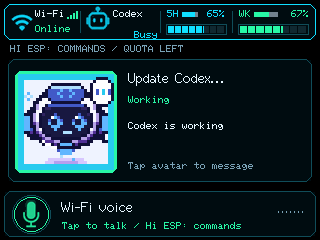

# Adaptive monitor UI device check — 2026-10-07

User authorized flash and testing of the existing FNK0104B.

## Build and flash

- `pio run -e codex-monitor` passed: 3,103,825 flash bytes of the unchanged
  6,291,456-byte app slot (49.3%); 151,604 static RAM bytes.
- `pio test -e native`: all 25 tests passed.
- Firmware SHA256:
  `a64c7f4cf83fd049c30e4bd02f79c12756afe19e7f0a1193c43d2a76cf04de44`.
- Windows initially owned COM9, 303a:8360. A temporary localhost-only COM
  bridge allowed PlatformIO's 1200-baud monitor request to enter ROM recovery
  (303a:1001, COM7); USB/IP then attached /dev/ttyACM0 to WSL. The COM open
  was interrupted by the expected USB identity change.
- `pio run -e codex-monitor -t upload --upload-port /dev/ttyACM0` exited
  SUCCESS in 78.62 seconds. Esptool identified ESP32-S3 revision v0.2,
  MAC B8:1F:3F:C3:9F:94, and verified bootloader, partition, model and app
  hashes. Models: 3,518,072 bytes at 0x610000; app: 3,104,224 bytes at 0x10000.
- The configured watchdog reset started the app. No physical BOOT/RESET or
  upload retry was needed. Existing partition boundaries and NVS were retained;
  no full-chip erase, GPIO or security-setting changes occurred.

## Runtime and actual LCD

PlatformIO monitored native CDC at 115200 baud for 145 seconds. The
[serial record](monitor-adaptive-ui-2026-10-07/runtime.log) shows Wi-Fi connected,
status/voice workers running, speech ready with no error, and raw microphone
ready. Internal free heap settled at 10,027 bytes; free PSRAM was approximately
4.43 MB. Continuous AFE frames reached 4,710 without observed reset/panic.
VAD detected speech/silence. USB streaming was inactive and its drop count was
zero; this does not establish captured host audio quality.

Full LCD readback verified **Codex Busy**, live quotas/agents and the single
full-width **Wi-Fi voice** control before Desktop discovery:

USB was returned to Windows without reflashing. HID, CDC and UAC1 devices
reported healthy Windows status. A temporary localhost-only COM bridge kept
PlatformIO as the 115200-baud monitoring interface. The [Windows serial
record](monitor-adaptive-ui-2026-10-07/windows-runtime.log) contains repeated
decoded `device.status` and `v.oai.thstatus`, completed report-6 replies,
retained host slot revisions, and continued speech/Wi-Fi status updates.
This exercises discovery state selecting Micro mode; protocol traffic does
not independently authenticate the host application.

Windows LCD capture was incomplete (90–92 of 240 rows) through both bridge
implementations; Micro appearance was not visually device-verified. No
incomplete image was saved as a verified screenshot. Synthetic HID probes
could not open Linux hidraw without elevated permission or the Windows device
path; the live host requests above are the successful HID evidence.

Temporary bridges closed after testing; USB remains owned by Windows for
Desktop and physical touch/voice checks. No permanent service was added.

## Open checks and memory conclusion

Physical Wi-Fi touch-to-record/send, Micro ACT10 edges, Desktop microphone
recording/transcription, Micro Idle, USB disconnect/reconnect layout recovery
and sustained memory stability remain UNKNOWN. The user was asked to perform
the Wi-Fi touch check; no result was available when this record was written.

The app fits in flash and this upload/boot passed. Internal RAM has limited
headroom; the earlier WakeNet allocation failure is recorded in the
[audio recovery evidence](codex-audio-2026-10-04.md). No features were disabled.

## Final label refinement and reflash

The idle Codex label was shortened to **Online** and status text restored below
the title at y=25, matching Wi-Fi. Host preview verified the layout.
The rebuilt app uses 3,103,809 bytes (49.3%); static RAM remains 151,604 bytes.
Firmware SHA256:
`cbda815b796e4dea19d6ebd6e8e3470aeb0bb002d2286dbdec893e4e3060a439`.

PlatformIO upload exited SUCCESS in 76.13 seconds and verified all four image
hashes. The app image was 3,104,208 bytes. Existing NVS/partition boundaries
were retained; the watchdog reset started the firmware.

Windows owned USB after reset and prevented WSL attachment. The temporary
localhost COM9 bridge allowed the required 115200-baud PlatformIO check.
[Final serial evidence](monitor-adaptive-ui-2026-10-07/online-runtime.log)
confirms speech/audio ready, Wi-Fi connected, status/voice workers running,
completed HID discovery/status replies and 10,083 free internal heap bytes.
This short check is not a sustained-use test. The original screenshot in this
record predates the refinement; physical appearance of the new position is
not claimed from that image. USB remains on Windows after testing.
